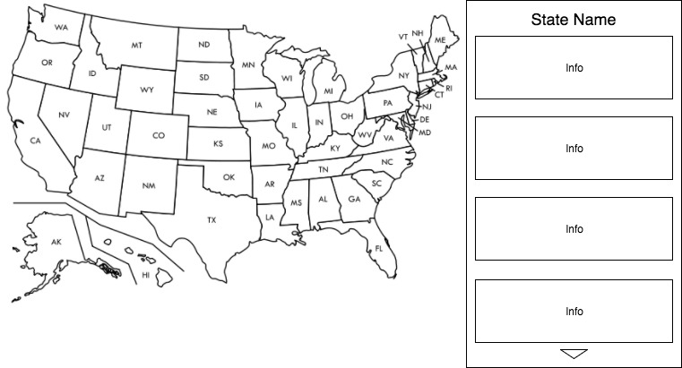

## JS Project Proposal: Interactive Congress Map

### Background

The interactive congress map will render a map of the US on the page and upon clicking a state, a list of all the state's elected congressmen will appear, with relevant information such as name, district, official website, contact details and twitter feed. Map will be rendered using D3.js library, information regarding congressmen will be sourced via the propublica API, and data will be fetched using a jQuery ajax request in order to Incorporate the required cURL header for the propublica API. A politician's show page will include their twitter feed with a few of their latest tweets. Frontend React/Redux Architecture will allow for a smooth user experience, only requiring AJAX requests upon loading the map and opening a given politician's show page.

### Functionality & MVP  

With Interactive Congress Map, users will be able to:

- [ ] View the map of the United States and see political orientation of states (red, blue, purple)
- [ ] Select a given state to see a list of congressmen representing that state
- [ ] Select a given elected official to see a show page of relevant information including contact information and Twitter feed

In addition, this project will include:

- [ ] An About modal describing the project and its features
- [ ] A production README

### Wireframes

This app will consist of a single screen with map, sidebar with politicians, and nav links to the Github, my LinkedIn, and the About modal. Controls and options will include, choosing a state from the map to bring up a list of elected officials, and choosing an official from the list to bring up a show page.

### Architecture and Technologies

This project will be implemented with the following technologies:

- `D3.js` for interactive map rendering,
- `ProPublica API` with jQuery for AJAX requests with cURL and required key and headers,
- `Webpack` to bundle js files.
- `Twitter API` to bring up politicians' twitter feeds
- `react/redux` on frontend for storing states' state.
- `Google Search API` to render an image of the politician on the showpage

In addition to the entry file, there will be three scripts involved in this project:

`map.js`: this D3 incorporated script will handle the logic for rendering the map, including coloring states according to party distribution.

`api_utils.js`: this script will handle the ajax requests for propublica, twitter and google

### Implementation Timeline

**Day 1**: Setup all necessary Node modules, including getting webpack up and running and `D3.js` installed. Write a basic entry file and the bare bones of the scripts outlined above.  Learn the basics of `D3.js`. Goals for the day:

- Get a green bundle with `Webpack`
- Learn enough `D3.js` to render an object to the HTML body element

**Day 2**: Learn and write appropriate methods for propublica and twitter api's, and start linking map functionality with API queries. Goals for the day:

- Be able to bring up a State's name by clicking it on the D3 map
- Be able to make an ajax call to the propublica API with given State's name and return relevant information
- Build out basic redux store and have a sample state shape

**Day 3**: Finish map react component, add click handlers, and style politician lists and show pages. Goals for the day:

- Render full color map based on political leaning (red, blue, purple)
- Click a state on the page and bring up styled list of all associated elected officials
- Click on an elected official to bring up more detailed information and twitter feed

**Day 4**: Incorporate more useful features such as rendering an image of the politician on the show page.

- Write logic for providing user with next election date for a given official
- provide a chart with visual information based on some useful data from either propublica api or another api
- If time: include a feature to compare 2 politicians side by side

### Bonus features

There are many directions this project could eventually go.  Some anticipated updates are:

- [ ] Incorporate Google maps API for more specific pinpointing of politicians in a given district
- [ ] Add options to contact the politician directly through the app
- [ ] More data visualizations based on available information about politicians on existing api's
